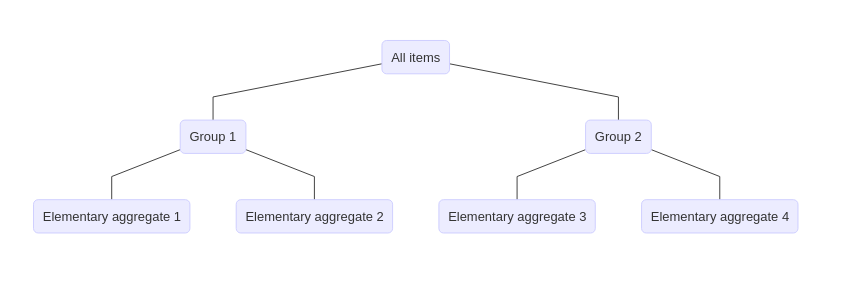
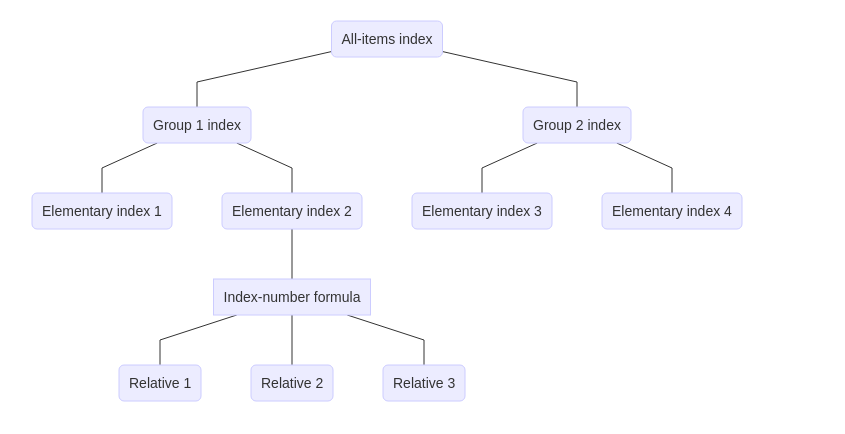

# (PART) Introduction to Price Indices{-}

# Syllabus

A price index gives a way to systematically condense information about many prices for a range of goods and services into a single value. Price indices are widely used to analyze and compare macroeconomic conditions over time, and have important implications for government policies.

The goal of this module is to provide an introduction to price indices, with an application to price indices for the inputs and outputs of production (producer price index), and for prices faced by consumers (consumer price index). By the end of the module, an individual should:

1. Understand the reasons why price indices are compiled, and why they're important.

2. Be familiar with common index-number formula and how to manipulate them.

3. Have a basic understanding of the structure of a price index and its calculation.

This module is useful for both users and compilers of prices indices with little prior knowledge of the uses and construction of a price index.

This module consists of self-directed readings, along with an assignment. In total, about 10 to 15 hours should be devoted for this module

There are no prerequisites for this module, although individuals should be comfortable with basic algebra and simple mathematical arguments. An introductory course in macroeconomics is helpful.

Evaluation for this module is based on an assignment consisting of 20 multiple-choice/true-false questions that draw on material in the course content and readings. Collaboration on the assignment is welcomed, but each person must submit their own unique work. Passing this module requires at least a 65% on the assignment.

Readings for this module come from chapters 1, 2, 4, and 9 of the Producer Price Index Manual [@ppimanual] and/or the Consumer Price Index Manual [@cpimanual], published by the IMF (freely available on their website). As there is a considerable amount of overlap between these sources, the PPI manual is used as the main reference.

Please email the course instructor if you have any questions, or need help with any of the course material or assignment.

# What’s a price index and why do we need one?

A price index is a tool to measure the change in price for goods and services over time. Price indices have a long history, and are an important and widely used macroeconomic statistic. This section of the course begins by introducing what a price index is, what they're used for, and why a price index is needed at all.

&#128214; PPI manual: Chapter 1, sections A, K; Chapter 2, sections A, B, D1, D2, E, F.

&#128214; CPI manual: Chapter 1, paragraphs 1.8--1.12; Chapter 2.

## What's a price index?

A price index is an economic time series that gives the percent change in prices for a collection of goods and services between a given point in time and a fixed base period (or reference period).^[A price index can also be used to measure the difference in prices in different locations at the same point in time, although this is a less common use of a price index.] A price index is usually represented so that subtracting 100 from the value of the index gives the percent change in prices for the goods and services captured by the index. For example, if a price index for widgets has a value of 110 in some period, then prices for widgets have increased by 10% since the base period. This representation also means that the index has a value of 100 in the base period. 

The chart below gives an example of a monthly price index showing the change in prices in each month of the year with respect to January (the base period), so that each point on the graph gives the percent change in prices since January. For example, in March the index had a value of 103, meaning prices increased by 3% between March and January, whereas the index had a value of 99 in June, meaning prices decreased by 1% between January and June.

```{r, echo=FALSE}
library(ggplot2)
ggplot() +
  geom_line(aes(seq(as.Date("2020-01-01"), as.Date("2020-12-01"), "month"),
                c(100, 102, 103, 101, 99.5, 99, 100.5, 101, 101.5, 100, 102, 105))) +
  labs(x = "Month", y = "Index value", title = "Example of a price index") +
  theme_classic() +
  lims(y = c(98, 106)) +
  scale_x_date(date_labels = "%b")
```

Since a price index only measures the relative change in prices since the base period, changing the scale of the index does not change its economic content. For example, dividing all values in the above chart by 100 does not change the shape of the graph, or the resulting percent change in the index value since the base period. It is for this reason that the magnitude of a price index does not give a measure of the price level at a point in time---a price index can only measure the change in prices over time. 

The usefulness of a price index is that it gives a way to systematically condense information about many prices for a range of goods and services into a single value that measures the change in prices for these goods and services over time. Although which goods and services form the scope of a price index depends on its purpose, all price indices give a measure of aggregate price movements for a well-defined set of commodities. This in turn gives a measure of inflationary pressures in an economy, and consequently price indices are ubiquitous when examining macroeconomic conditions and policies.

## Uses of a price index

In practice there are two broad categories that the price indices published by national statistical agencies fall into: consumer price indices (CPIs) and producer price indices (PPIs). As the names suggest, CPIs are focused on measuring price changes for goods and services that are purchased by consumers (final consumption), whereas PPIs focus on measuring prices charged by producers for goods and services produced, and prices paid for inputs into production. Despite the many subtleties about what constitutes a consumer and what constitutes a producer, both CPIs and PPIs seek to measure the change in prices over time for the goods and services that are transacted in an economy. Consequently, there is often
considerable overlap in how CPIs and PPIs are calculated and used, and a distinction does not need to be made between whether an index is a CPI or a PPI---it often suffices to talk about a general price index.

Probably the most important use of a price index, be it a CPI or a PPI, is to measure inflation---the systematic change in prices in an economy over time. Beyond being an important macroeconomic indicator, the measure of inflation directly affects many economic interactions in modern economies. For instance, many central banks operate in a regime of inflation targeting, whereby monetary policy is conducted in part to keep the inflation rate in a predetermined range (e.g., 1% to 3% a year). This policy regime requires a (frequent and timely) measure of inflation, however, and the instrument used to measure inflation can have a direct impact on monetary policy, and consequently interest rates. Inflation also affects wages and service contracts, pension payments, and social security benefits, as these contracts are often indexed to inflation---if prices increase by 2% per year, then wages also increase by 2% per year. Indexation preserves the value of payments over time without constantly needing to renegotiate contracts or redesign policies. The measure of inflation thus has important implications for household income and industry revenues.

Beyond measuring inflation, one of the major uses of price indices for national statistical agencies is to deflate aggregate values in a national accounting framework to get a measure of the change in the production of real goods and services over time. This is equivalent to finding a quantity index to systematically condense information about many outputs for a range of goods and services into a single value that measures the change in the quantity of goods and services produced over time. Although there are many details, the rationale behind deflating aggregates values to get a measure of real output is fairly simple. If $V_1/V_0$ is the ratio of the value of production in period 1 to the value of production in period 0, and if this can be decomposed into a quantity index $Q$ and a price index $I$ such that $V_1/V_0 = IQ$, then the change in real production between period 0 and period 1 is simply $Q = V_1 / (V_0 I)$. The change in the value of production over time---a known quantity---can be turned into a measure of the change in real output by simply deflating it with a price index.

## Why a price index?

The starting point for understanding the utility of a price index is recognizing that there is no need for one if the goal is to compare the price of a single good or service in one period to the price for the same good or service in another period. If $p_1$ is the price of a good in period 1 and $p_0$ is the price of that same good in period 0, then the price relative $p_1/p_0$ unambiguously gives the percent change in price between period 1 and period 0. The need for a price index arises out of a fundamental problem of comparing a collection two or more of prices at two points in time to arrive at an overall change in price.

To illustrate this comparison problem, suppose there are two goods, denoted by $i$ and $j$, that sell in periods 0 and 1. If the price of good $i$ and the price of good $j$ both increase between period 0 and period 1, then it is uncontroversial to say that prices have increased between period 0 and period 1 (although it is less obvious by how much prices have increased). Similarly, if both prices decrease, then it is natural to say that prices have decreased. However, an issue arises if the price of good $i$ increases between period 0 and
period 1 while the price of good $j$ decreases. In this case it is unclear if prices have increased or decreased---there is no obvious way to give a single direction to the movement of prices over time.

A solution to this comparison problem is to find a way to aggregate price relatives for many goods and services together to form a single ratio, which is then interpreted as the overall movement in prices over time. This is the job of a price index. Although a price index solves the comparison problem, it introduces a new challenge---how to best combine price relatives to produce a single measure that describes overall change in prices. Consequently, a variety of index-number formula have been proposed to construct a price index.

# Index-number formula

There are a great many index-number formula that can be used to combine information on prices at two points in time to produce a price index, despite the common goal of measuring price changes over time. This section of the course covers 10 important index-number formula that are used in practice to calculate a price index. Associated with each formula is the name of the person who developed it, and it is important to associate the names with the formulas, as they are usually referred to by name in application. This is unfortunately an exercise is memorization, as most of the index-number formula have a similar form.

To help build intuition and a deeper understanding of what the index-number formula are doing, these different approaches for calculating a price index can be broadly classified as either arithmetic price indices or geometric price indices. Not all index-number formula fall into these two groups---for example, there are also harmonic price indices, a category which can overlap with arithmetic indices---but arithmetic and geometric indices are fairly easy to understand, with most index-number formula falling into one of these two categories. 

In practice a price index is multiplied by 100, so that the percent change in the index value over two periods is simply the index value minus 100. This is just a convenient normalization that has no bearing on the economic content of a price index, and is ignored in this section. (All the index-number formula can be multiplied by 100 to put them on the usual scale.)

&#128214; PPI manual: Chapter 1, sections B1--B3.

## Arithmetic price indices

An arithmetic price index takes price relatives for a collection of goods and services over two periods and combines them together as a weighted average. That is, an arithmetic index is simply the average change in price between two points in time. Letting goods be enumerated by $i = 1,\ldots, n$, an arithmetic index between period 0 and period 1 has the general form^[The capital letter sigma $\Sigma$ is the summation operator. For a collection of numbers $x_{1}, x_{2},\ldots,x_{n}$, $\sum_{i=1}^{n} x_{i}$ means $x_{1} + x_{2} + \ldots + x_{n}$.]

\begin{align*}
I^{A} = \sum_{i = 1}^{n} \omega_{i} \frac{p_{i1}}{p_{i0}},
\end{align*}

where $p_{it}$ is the price of good $i$ in period $t = 0,1$, and $\omega_{i} \geq 0$ is the weight that good $i$ receives in the index calculation, such that $\sum_{i = 1}^{n} \omega_{i} = 1$.

Different arithmetic price indices correspond to special cases of the general arithmetic index, depending on the choice of the weights. Most of these choices make use of information about the quantity of a good sold, so that the weights give a measure of the economic importance of a good, and so let $q_{it}$ be the amount of good $i$ consumed/produced in period $t = 0,1$.

Before examining specific arithmetic indices, it is worth noting that an arithmetic index can always be written as the ratio of expenditure/revenue for a "basket" of goods and services at two points in time, so that for any set of weights there are implied "quantities" such that

\begin{align*}
I^{A} = \frac{\sum_{i = 1}^{n} p_{i1} \tilde{q}_{i}}{\sum_{i = 1}^{n} p_{i0} \tilde{q}_{i}},
\end{align*}

where $\tilde{q}_{i} = \alpha \omega_{i} / p_{i0}$ for some factor of proportionality $\alpha$. Thus, an arithmetic index can always be interpreted as the ratio of the expenditure required to purchase a fixed basket of goods at two points in time (or the revenue from a fixed basket of goods at two points in time). The choice of basket is linked one-to-one with the choice of weights used to aggregate price relatives. Both representations of the arithmetic index get used, as some indices are easier to represent in one form than the other.

## Common arithmetic indices

There are six main arithmetic price indices that get used in practice, each corresponding to a different statement about how much weight a price relative should receive in the index calculation.

**Carli index**. Setting $\omega_{i} = 1 / n$ results in the Carli index

\begin{align*}
I^{A}_{C} = \frac{1}{n} \sum_{i = 1}^{n} \frac{p_{i1}}{p_{i0}}.
\end{align*}

The Carli index takes an agnostic view of the weights, and treats each price relative as equally important.

**Dutot index**. Setting $\omega_{i} = p_{i0} / \sum_{j = 1}^{n} p_{j0}$ results in the Dutot index

\begin{align*}
I^{A}_D = \frac{\sum_{i = 1}^{n} p_{i1}}{\sum_{i = 1}^{n} p_{i0}}.
\end{align*}

The Dutot index gives more weight to price relatives that have a greater period-0 price, comparing the average price of goods in period 1 to the average price in period 0.

**Lowe index**. Setting $\omega_{i} = p_{i0} q_{ib} / \sum_{j = 1}^{n} p_{j0} q_{jb}$ results in the Lowe index

\begin{align*}
I^{A}_{l} = \frac{\sum_{i = 1}^{n} p_{i1} q_{ib}}{\sum_{i = 1}^{n} p_{i0} q_{ib}},
\end{align*}

where $q_{ib}$ is the quantity of good $i$ in some base period $b$, usually prior to period 0. The weights for the Lowe index are "hybrid" expenditure/revenue shares for the basket of goods and services in period $b$ using period 0 prices.

**Laspeyres index**. Setting $\omega_{i} = p_{i0} q_{i0} / \sum_{j = 1}^{n} p_{j0} q_{j0}$ results in the Laspeyres index

\begin{align*}
I^{A}_{L} = \frac{\sum_{i = 1}^{n} p_{i1} q_{i0}}{\sum_{i = 1}^{n} p_{i0} q_{i0}}.
\end{align*}

The Laspeyres index weights price relatives according to their period-0 expenditure/revenue share, and is a special case of the Lowe index.

**Paasche index**. Setting $\omega_{i} = p_{i0} q_{i1} / \sum_{j = 1}^{n} p_{j0} q_{j1}$ results in the Paasche index

\begin{align*}
I^{A}_{P} = \frac{\sum_{i = 1}^{n} p_{i1} q_{i1}}{\sum_{i = 1}^{n} p_{i0} q_{i1}}.
\end{align*}

Like the Laspeyres index, the Paasche index is a special case of the Lowe index, and uses hybrid expenditure/revenue shares to weight price relatives. 

It is worth noting that the Paasche index is often calculated as a weighted harmonic average, with period 1 expenditure/revenue shares as weights, so that 

\begin{align*}
I^{A}_{P} = \left(\sum_{i = 1}^{n} \frac{\frac{p_{i1} q_{i1}}{\sum_{j = 1}^{n} p_{j1} q_{j1}}}{\frac{p_{i1}}{p_{i0}}}\right)^{-1}.
\end{align*}

This is an example of a harmonic price index, and is a convenient way to calculate a Paasche index if only period-1 expenditure/revenue shares are known, rather than period-1 quantities.

**Young index**. Setting $\omega_{i} = p_{ib} q_{ib} / \sum_{j = 1}^{n} p_{jb} q_{jb}$ results in the Young index

\begin{align*}
I^{A}_{Y} = \sum_{i = 1}^{n} \frac{p_{ib} q_{ib}}{\sum_{j = 1}^{n} p_{jb} q_{jb}} \frac{p_{i1}}{p_{i0}},
\end{align*}

where $q_{ib}$ is the quantity of good $i$ in some base period $b$, with $p_{ib}$ as the price, usually prior to period 0. The Young index uses period $b$ expenditure/revenue shares as weights.^[In some cases a Young index is used to refer to a general arithmetic index, rather than an arithmetic index with a particular set of weights.] The Laspeyres index is a special case of the Young index.

In most applications a Laspeyres index is the desired index-number formula for an arithmetic price index, in part because the weights can be observed separately from the price information. Weights for a CPI, for example, can come from a nationally representative survey of household spending, and so only price information needs to be collected to calculate a Laspeyres index. Although the Young weights are directly observable as well, they do not necessarily reflect changes in the composition of spending or sources of revenue between period $b$ and period 0. Alternatively, both the Lowe and Paasche indices have weights that need to be explicitly calculated. Like the Young index, the Lowe index uses out-of-date quantity information, whereas the Paasche index uses current-period quantity information, and this usually means that it cannot be computed in a timely manner. 

Despite the goal of calculating a Laspeyres index, in most applications an arithmetic index is often calculated as a Young index (or sometimes a Lowe index), as it is difficult to get timely expenditure/revenue share information. Waiting for the weighting information may require delaying the production of an index until well after period 0. The hope is that the weights used in the Young index offer a reasonable approximation for the Laspeyres weights.

## Less common arithmetic indices

There are a variety of arithmetic indices that are rarely used in practice, but can be useful to know about. As these index number formula are seldom used, this material can be safely be skipped.

**Palgrave index**. Setting $\omega_{i} = p_{i1} q_{i1} / \sum_{j = 1}^{n} p_{j1} q_{j1}$ results in the Palgrave index

\begin{align*}
I^{A}_{p} = \sum_{i = 1}^{n} \frac{p_{i1} q_{i1}}{\sum_{j = 1}^{n} p_{j1} q_{j1}} \frac{p_{i1}}{p_{i0}}.
\end{align*}

The Palgrave index uses period-1 expenditure shares as weights, and is a special case of the Young index.

**Unnamed index**. Setting 

\begin{align*}
\omega_{i} = \frac{1}{2} \frac{p_{i0} q_{i0}}{\sum_{j = 1}^{n} p_{j0} q_{j0}} + \frac{1}{2} \frac{p_{i1} q_{i1}}{\sum_{j = 1}^{n} p_{j1} q_{j1}}
\end{align*}

results in an index-number formula without a name,

\begin{align*}
I^{A}_{U} = \sum_{i = 1}^{n} \left(\frac{1}{2} \frac{p_{i0} q_{i0}}{\sum_{j = 1}^{n} p_{j0} q_{j0}} + \frac{1}{2} \frac{p_{i1} q_{i1}}{\sum_{j = 1}^{n} p_{j1} q_{j1}}\right) \frac{p_{i1}}{p_{i0}}.
\end{align*}

This index is a mixture of the Laspeyres and Palgrave indices, with weights given by the average expenditure/revenue share between period 0 and period 1.

**Drobisch index**. Setting 

\begin{align*}
\omega_{i} = \frac{1}{2} \frac{p_{i0} q_{i0}}{\sum_{j = 1}^{n} p_{j0} q_{j0}} + \frac{1}{2} \frac{p_{i0} q_{i1}}{\sum_{j = 1}^{n} p_{j0} q_{j1}}
\end{align*}

results in the Drobisch index

\begin{align*}
I^{A}_{d} = \frac{1}{2} \frac{\sum_{i = 1}^{n} p_{i1} q_{i0}}{\sum_{i = 1}^{n} p_{i0} q_{i0}} + \frac{1}{2} \frac{\sum_{i = 1}^{n} p_{i1} q_{i1}}{\sum_{i = 1}^{n} p_{i0} q_{i1}}.
\end{align*}

This index is a mixture of the Laspeyres and Paasche indices.

**Walsh index**. Setting $\omega_{i} = p_{i0} \sqrt{q_{i0} q_{i1}} / \sum_{j = 1}^{n} p_{j0} \sqrt{q_{j0} q_{j1}}$ results in the Walsh index

\begin{align*}
I^{A}_{W} = \frac{\sum_{i = 1}^{n} p_{i1} \sqrt{q_{i0} q_{i1}}}{\sum_{i = 1}^{n} p_{i0} \sqrt{q_{i0} q_{i1}}}.
\end{align*}

This index uses a basket that contains the geometric average of the period-0 and period-1 quantities.

**Marshall-Edgeworth index**. Setting $\omega_{i} = p_{i0} (q_{i0} + q_{i1}) / \sum_{j = 1}^{n} p_{j0} (q_{j0} + q_{j1})$ results in the Marshall-Edgeworth index

\begin{align*}
I^{A}_{M} = \frac{\sum_{i = 1}^{n} p_{i1} (q_{i0} + q_{i1}) / 2}{\sum_{i = 1}^{n} p_{i0} (q_{i0} + q_{i1}) / 2}.
\end{align*}

Like the Walsh index, this index uses a basket that takes an average of the period-0 and period-1 quantities.

## Geometric price indices

A geometric price index is entirely analogous to an arithmetic one, except that price relatives are aggregated with a geometric average instead of an arithmetic average. That is, a general geometric price index is given by^[The capital letter pi $\Pi$ is the product operator. For a collection of numbers $x_{1}, x_{2},\ldots,x_{n}$, $\prod_{i=1}^{n} x_{i}$ means $x_{1} \times x_{2} \times \ldots \times x_{n}$.]

\begin{align*}
I^{G} = \prod_{i = 1}^{n} \left(\frac{p_{i1}}{p_{i0}}\right)^{\omega_{i}}.
\end{align*}

As with the arithmetic indices, different geometric indices correspond to different choices for the weights.

**Jevons index**. Setting $\omega_{i} = 1 / n$ results in the Jevons index

\begin{align*}
I^{G}_{J} = \prod_{i = 1}^{n} \left(\frac{p_{i1}}{p_{i0}}\right)^{1 / n},
\end{align*}

or, equivalently,

\begin{align*}
I^{G}_{J} = \frac{\prod_{i = 1}^{n} p_{i1}^{1 / n}}{\prod_{i = 1}^{n} p_{i0}^{1 / n}}.
\end{align*}

The Jevons index is the geometric analogue to the Carli or Dutot index.

**Geometric Laspeyres index**. Setting $\omega_{i} = p_{i0} q_{i0} / \sum_{j = 1}^{n} p_{j0} q_{j0}$ results in the geometric Laspeyres index

\begin{align*}
I^{G}_{L} = \prod_{i = 1}^{n} \left(\frac{p_{i1}}{p_{i0}}\right)^{\frac{p_{i0} q_{i0}}{\sum_{j = 1}^{n} p_{j0} q_{j0}}}.
\end{align*}

Similar to the Jevons index, this is the geometric analogue of the Laspeyres index. It is trivial to define a geometric Young index as well.^[Defining a geometric Lowe index is less obvious. For example, the geometric Paasche index uses period-1 expenditure/revenue shares as weights, instead of the hybrid weights used for the arithmetic Paasche index. Perhaps a better name for this index would be the geometric Palgrave index.]

**Törnqvist index**. Setting 

\begin{align*}
\omega_{i} = \frac{1}{2} \frac{p_{i0} q_{i0}}{\sum_{j = 1}^{n} p_{j0} q_{j0}} + \frac{1}{2} \frac{p_{i1} q_{i1}}{\sum_{j = 1}^{n} p_{j1} q_{j1}}
\end{align*}

results in the Törnqvist index, which is usually expressed as

\begin{align*}
\log(I^{G}_{T}) = \sum_{i = 1}^{n} \left(\frac{1}{2} \frac{p_{i0} q_{i0}}{\sum_{j = 1}^{n} p_{j0} q_{j0}} + \frac{1}{2} \frac{p_{i1} q_{i1}}{\sum_{j = 1}^{n} p_{j1} q_{j1}}\right) \log\left(\frac{p_{i1}}{p_{i0}}\right).
\end{align*}

The Törnqvist index expands on the geometric Laspeyres index by using expenditure shares in both period 0 and period 1 to form weights (i.e., the average expenditure share between period 0 and period 1).

The Jevons index is usually synonymous with a geometric index, and it finds application in situations where there is no quantity information to form weights (as opposed to using a Carli or Dutot index). Sometimes a weighted Jevons index is used as a shorthand for the general geometric index.

One point to note about the geometric indices is that they are always smaller than their arithmetic counterparts. For any given weights, it can be shown that $I^{G} \leq I^{A}$, with equality only when all price relatives are equal or all price relatives except one have zero weight. Consequently, a geometric index always shows a smaller increase in prices over time (or a larger decrease) than the corresponding arithmetic index.^[The difference between an arithmetic index and geometric index tends to be larger when price relatives are more dispersed, although this is not always the case. It is possible that the difference becomes larger when the variance between prices relatives becomes smaller---see @lord2002.] This is an important downside to having a menu of index numbers to choose from, as the choice of which index number formula to use has an impact on the resulting measure of inflation.^[The same reasoning can be used to show that a harmonic price index is always smaller than the corresponding geometric index---see @bullen2003[II 2.1 Corollary 2].]

## The Fisher index

One important price index that is neither a geometric index nor an arithmetic index is the Fisher index, which is the geometric average of the (arithmetic) Laspeyres index and the (arithmetic) Paasche index,

\begin{align*}
I_{F} = \sqrt{\frac{\sum_{i = 1}^{n} p_{i1} q_{i0}}{\sum_{i = 1}^{n} p_{i0} q_{i0}} \times \frac{\sum_{i = 1}^{n} p_{i1} q_{i1}}{\sum_{i = 1}^{n} p_{i0} q_{i1}}}.
\end{align*}

The Fisher index is often seen as an ideal index because it treats information in period 0 and period 1 symmetrically. (The Törnqvist index is also seen as ideal for a similar reason, and these types of indices often get called superlative.) In practice, however, the Fisher index is not frequently used by national statistical agencies because it is not timely to calculate. This is because it depends on the Paasche index, which requires information on period 1 quantities in addition to period 1 prices, something that has historically been impractical for national statistical agencies to collect.

## Example with R

All of the index-number formula presented in this section are simply weighted averages, and are fairly easy to calculate in R given information on prices and some weights.

```{r}
# Bring in ppd library
library(ppd)

# Make some price relatives
relatives <- c(1.1, 1.2, 0.9, 1.1)

# Make some weights
weights <- c(0.25, 0.3, 0.3, 0.15)

# Calculate indices
c(
  Carli = mean(relatives), 
  Jevons = geomean(relatives), 
  Arithmetic = weighted.mean(relatives, weights),
  Geometric = geomean(relatives, weights)
)
```

The type of arithmetic and geometric indices that this calculates depends entirely on how the weights are calculated. Usually, weights come from data on expenditure/revenue shares, and how this information is used to weight price relatives will affect the type of price index that is calculated.

```{r}
# Base-period expenditure/revenue share
share0 <- c(0.25, 0.3, 0.3, 0.15) 

# Current-period expenditure/revenue share
share1 <- c(0.2, 0.2, 0.4, 0.2)

# Calculate indices
c(
  Laspeyres = weighted.mean(relatives, share0),
  Paasche = harmean(relatives, share1),
  Fisher = sqrt(weighted.mean(relatives, share0) * harmean(relatives, share1)),
  `Geometric Laspeyres` = geomean(relatives, share0),
  `Geometric Paasche` = geomean(relatives, share1),
  Tornqvist = geomean(relatives, (share0 + share1) / 2)
)

```

# Computing a price index

Any of the index-number formula in the previous section can be used to make a price index that measures the change in price for a single collection of goods and services over two periods. In application, however, price indices are computed for a variety of different goods and services, and are computed over many periods, not just two. These two points have implications for how the index-number formula in the previous section are used to calculate a price index in practice. This section of the course explores how the two-period index-number formula in the previous section can be used to calculate a price index for several groups of goods and services over many time periods.

&#128214; PPI manual: Chapter 4, section D; Chapter 9, paragraphs 9.6--9.24 and sections B3, B4, C1--C7.2.

&#128214; CPI manual: Chapter 1, paragraphs 1.147--1.164; Chapter 4, paragraphs 4.16--4.33.

# Sub-indices and aggregation

Most price indices have a hierarchical (or aggregated) structure, so that goods and services are partitioned into increasingly broad groups or categories that build up to all goods and services covered by the price index. For example, the goods in a CPI can be partitioned into broad categories such as food, shelter, transportation, etc. These categories are then broken into smaller categories; food may be partitioned into meat, diary, poultry, etc. This type of structure has the obvious benefit of providing a price index for sub-categories of goods and services that are often of interest in their own right (although there are other, more subtle reasons for wanting to structure a price index like this). The chart below gives an example of a simple aggregation structure with three levels.



```{r, eval=FALSE, echo=FALSE}
library(DiagrammeR)
mermaid("
  graph TD
    A(All items) --- B(Group 1)
    A --- C(Group 2)
    B --- B1(Elementary aggregate 1)
    B --- B2(Elementary aggregate 2)
    C --- C1(Elementary aggregate 3)
    C --- C2(Elementary aggregate 4)
",
height = 256)
```

A hierarchical structure does not pose any special challenges for making a price index---one of the index-number formula from the previous section can always be used to aggregate the price relatives for the goods and services in each group of the hierarchy to produce a collection of price indices for each level in the hierarchy. The index calculation simply needs to be repeated for each group of goods and services in the aggregation structure. This is the direct approach to calculating a price index with a hierarchical structure.

Having a hierarchical structure, however, suggests that the calculation can be simplified with a two-step procedure. In the first step, price relatives are combined at the lowest level of aggregation using one of the index-number formula from the previous section. This gives a collection of price indices called elementary (or elemental) indices. These price indices give the movement in price over time for small, relatively homogeneous groups of goods and services called elementary aggregates that form the basis of a price index. Once the elementary indices have been calculated, indices for higher levels of aggregation are calculated by combining elementary indices using weights. These weights provide a measure of the economic importance of the goods and services in each elementary aggregate in order to combine elementary indices together to form a higher-level index. If the target index is an arithmetic index, then the elementary aggregates should be combined with a weighted arithmetic average; otherwise, if a geometric index is the target index, a weighted geometric averaged should be used. Put differently, each elementary aggregate is treated as a single good, with the elementary indices being the price relatives for these goods, and this information is fed into an index-number formula to produce a higher-level index.



```{r, eval=FALSE, echo=FALSE}
mermaid("
  graph TD
    A(All-items index) --- B(Group 1 index)
    A --- C(Group 2 index)
    B --- B1(Elementary index 1)
    B --- B2(Elementary index 2)
    C --- C1(Elementary index 3)
    C --- C2(Elementary index 4)
    B2 --- D
    D[Index-number formula] --- E1(Relative 1)
    D --- E2(Relative 2)
    D --- E3(Relative 3)
",
height = 368)
```

Given that there are two ways to calculate a price index with a hierarchical structure, does the direct calculation give the same result as the two-step calculation? The answer is yes for an arithmetic or geometric index, provided the weights used to aggregate the elementary aggregates are formed using the underlying weights for the target index. For example, if the goal is to calculate a Laspeyres index, then the weight for an elementary aggregate should be the expenditure/revenue share for the goods in that elementary aggregate in period 0. As both geometric and arithmetic indices are calculated as weighted averages, it should not be surprising that an index can be calculated by first grouping price relatives together, calculating group-level averages, then averaging the group-level averages to form an overall average. Consequently, these indices are said to be consistent in aggregation, although not all index-number formula are consistent in aggregation. For example, the Fisher index is not consistent in aggregation, and using the two-step procedure to calculate it will give a different answer than the direct calculation.

It is easy to show that any arithmetic index is consistent in aggregation (the reasoning for the geometric case is almost identical). Suppose that goods are partitioned into $k=1,\ldots,m$ distinct (mutually exclusive) categories---that is, there are $m$ elementary aggregates. If category $k$ contains $n_{k}$ goods, then the (arithmetic) index for this category is 

\begin{align*}
I_{k}^{A} = \sum_{i = 1}^{n_k} \frac{\omega_{ik}}{\sum_{j = 1}^{n_k} \omega_{jk}} \frac{p_{ik1}}{p_{ik0}},
\end{align*}

where $p_{ik1} / p_{ik0}$ is the price relative of good $i$ in category $k$ and $\omega_{ik}$ is the weight for good $i$ in category $k$. These $m$ indices can now be aggregated together to form an overall index by taking a weighted-average of each index, with weights given by $\omega_{k} = \sum_{j = 1}^{n_k} \omega_{jk}$, so that 

\begin{align*}
I^{A} &= \sum_{k = 1}^{m} \omega_k I_{k}^{A}  \\
&= \sum_{k = 1}^{m} \omega_k \sum_{i = 1}^{n_k} \frac{\omega_{ik}}{\sum_{j = 1}^{n_k} \omega_{jk}} \frac{p_{ik1}}{p_{ik0}} \\
&= \sum_{k = 1}^{m} \sum_{i = 1}^{n_k} \omega_{ik} \frac{p_{ik1}}{p_{ik0}}.
\end{align*}

But this is exactly the same as if the arithmetic index had been calculated by pooling all price relatives together and calculating the index directly, rather than partitioning them into groups and calculating the index in two steps.

One advantage of the two-step calculation over the direct calculation is that the index-number formula used to calculate the elementary indices can differ from the index-number formula used at higher levels aggregation. It may seem odd to want to do this, but there are a number of subtle theoretical and practical reasons why a different index-number formula should be used for the elementary indices. In most applications elementary indices are calculated using a Jevons index, partly because detailed information on quantities bought or sold may be difficult to obtain at very low levels of aggregation, with higher levels calculated as an arithmetic index (usually a Young or Lowe index). 

## Factoring an index

When calculated over many periods, a price index gives a measure of the change in prices over time relative to a fixed base period. Calculating a price index over many periods poses no new challenges---once a base period is selected, one of the index-number formula in previous section can be directly applied to produce an index that evolves over time by simply forming price relatives that always calculate the change in price relative to the base period. For example, the series of geometric indices computed over periods 0, 1, and 2, with period 0 as the base period, is

\begin{align*}
1, \prod_{i = 1}^{n} \left(\frac{p_{i1}}{p_{i0}}\right)^{\omega_{i}}, \prod_{i = 1}^{n} \left(\frac{p_{i2}}{p_{i0}}\right)^{\omega_{i}}.
\end{align*}

Thus the period 1 index value gives the change in prices between period 1 and period 0, and the period 2 index gives the change in prices between period 2 and period 0. The period 0 value is 1 because the ratio of period 0 prices to period 0 prices is always 1.

Most price indices are calculated frequently---usually monthly or quarterly---and it is useful to be able to calculate a price index using only the previous period's index value and the most recent price relatives for each good covered by the index.^[One reason is that it can make sampling price information easier, as the same units don't need to be sampled in both the current period and base period.] That is, it is useful to be able to factor an index into two terms: the previous period's index value, and an index that depends on only the current-period prices and previous-period prices. Such a factorization allows for an index to be calculated period-by-period, and saves from having to hold onto the price data in the base period for the life of an index. This is practically significant, as it means that an index can still be produced even if base-period price data are lost.

Factoring a geometric index is trivial; for a given set of weights, the geometric index that runs from period 0 to period $t$ can always be written as the product of the geometric index that runs for period 0 to period $k$ and the geometric index that runs from period $k$ to period $t$. That is,

\begin{align*}
I^{G}(0, t) &= \prod_{i = 1}^{n} \left(\frac{p_{it}}{p_{i0}}\right)^{\omega_i} \\
&= \prod_{i = 1}^{n} \left(\frac{p_{ik}}{p_{i0}}\right)^{\omega_i} \times \prod_{i = 1}^{n} \left(\frac{p_{it}}{p_{ik}}\right)^{\omega_i} \\
&= I^{G}(0, k) \times I^{G}(k, t).
\end{align*}

This should be deeply intuitive. If prices increased by 20% between period 0 and period $k$, and then increase by another 10% between period $k$ and period $t$, the total increase in price from period 0 to period $t$ is 32%. This is the same as multiplying an index value of 1.2 by an index value of 1.1, as the result is 1.32.

Factoring an arithmetic index is slightly more complex, as it requires changing the weights used to aggregate price relatives. The arithmetic index that runs from period 0 to period $t$ can be written as

\begin{align*}
I^{A}(0, t) &= \sum_{i = 1}^{n} \omega_{i} \frac{p_{it}}{p_{i0}} \\  
&= I^{A}(0, k) \times \sum_{i = 1}^{n} \tilde{\omega}_{i} \frac{p_{it}}{p_{ik}},
\end{align*}

where 

\begin{align*}
\tilde{\omega}_{i} = \frac{\omega_{i} \frac{p_{ik}}{p_{i0}}}{I^{A}(0, k)}. 
\end{align*}

Unlike the geometric index, factoring an arithmetic index requires changing the weights for the index running from period $k$ to $t$. Sometimes this gets called price updating the weights, but this terminology is used inconsistently. Despite this wrinkle, however, the basic idea is the same as in the geometric case---an arithmetic index can always be decomposed into two arithmetic indices.

Intuitively, factoring an index simply tinkers with value of the index in the base period so that it can continue from a previous value without needing to be recalculated from the start. Rather than starting the index at the value 1 in period $k$, it starts from the value of the index in period $k$, essentially building on the cumulative change in price up to that point in time.

## Rebasing

The base period is an important point in time for a price index, as it gives the fixed reference point to which price changes are measured against. Having to choose a base period at all, however, introduces a potential problem: what works as a base period for one use of a price index may not work for another. Fortunately the choice of base period doesn't have much impact on the economic content of a price index---in most cases a new base period can be chosen for an index without needing to recompute the entire index series.

For a geometric index, the choice of base period has no impact on the economic content of a price index---the change in price between any two periods is the same regardless of the base period. The base period simply standardizes the index to a particular level. This can be seen by recalling that a geometric index can always be factored into two geometric indices. Given an index series with period 0 as the base period, the index value in period $t$ with period $k$ as the base period can always be found by simply dividing the index value in period $t$ by the index value in period $k$

\begin{align*}
I^{G}(k, t) &= \prod_{i = 1}^{n} \left(\frac{p_{it}}{p_{ik}}\right)^{\omega_{i}} \\
&= \frac{\prod_{i = 1}^{n} \left(\frac{p_{it}}{p_{i0}}\right)^{\omega_{i}}}{\prod_{i = 1}^{n} \left(\frac{p_{ik}}{p_{i0}}\right)^{\omega_{i}}} \\
&= \frac{I^{G}(t, 0)}{I^{G}(k, 0)}.
\end{align*}

Hence, dividing through the index series by the period $k$ index value produces an index series that is the same as if period $k$ were originally chosen as the base period. This is known as rebasing an index, and means that a change in price between two periods can be computed by simply scaling the price index. This also explains why the base period gets a value in the index series, for otherwise the index series would shrink each time the index is rebased.

The chart below gives an example of how rebasing changes the time series. The index with a base period of December is simply the index with a base period of January divided by the value of the index in December (105). This simply shifts the index with January as the base period down, and squashes it a little, but does not change the relative shape of the time series.

```{r, echo=FALSE}
x <- seq(as.Date("2020-01-01"), as.Date("2020-12-01"), "month")
y <- c(100, 102, 103, 101, 99.5, 99, 100.5, 101, 101.5, 100, 102, 105)
g <- rep(c("Jan = 100", "Dec = 100"), each = 12)
dat <- data.frame(x = x, y = c(y, y / 105 * 100), g = g, stringsAsFactors = FALSE)
library(ggplot2)
ggplot(dat) +
  geom_line(aes(x, y, color = g)) +
  labs(x = "Month", y = "Index value", title = "Example of rebasing a price index", color = "Base period") +
  theme_classic() +
  lims(y = c(92, 106)) +
  scale_x_date(date_labels = "%b")
```

Rebasing is more complex for an arithmetic index. While it works for a Lowe and Dutot index in the exact same way a geometric index, in general rebasing an arithmetic index changes the weights used to average price relatives (because of the way an arithmetic index is factored). The rebased index is still an arithmetic index, but the weights are no longer correct. For example, rebasing a Laspeyres index changes the weights so that they are no longer the base-period expenditure shares---the index is still an arithmetic index (a Lowe index), but products that have seen a larger increase in price since the base period will receive more weight in the index calculation. In practice, however, this theoretical wrinkle is usually ignored, and an arithmetic price index gets rebased by simply dividing the entire index series by the index value in the new base period.

## Chaining

The weights for an index ideally give a measure of the economic importance of the goods that comprise the index, so that price relatives for goods and services with greater economic importance have a larger influence on the overall price movement between periods. In application the weights are often reused over time, as it is costly and time consuming to continuously update the weights. Keeping the same weights period after period, however, means that the weights will eventually become out of date, and may fail to capture changes in the economic importance of certain goods. Chaining an index provides a way to update the weights for an index and append new index values to the index series calculated with the old weights, without having to revise the old index series. Chaining can also be used to change the composition of goods and services covered by a price index, and this can change as new goods are introduced into a market and old goods disappear.

The idea behind chaining is the same as that for factoring an index---break an index into two pieces that can be glued together at a common overlap period. The difference is that while factoring an index is simply a trick of algebra, chaining an index is a practical solution for producing an index with a longer time series, rather than restarting the index in the period when the weights change. In both cases the idea is to modify the value in the base period of an index to reflect the cumulative change in price up to that point in time.

The steps for chaining any kind of index are the same, so consider an arithmetic index running from period 0 to period $t$, and suppose the weights for this index change in some period $k$. This could be because the previous weights have become sufficiently out-of-date that they need to change, or goods and services for which the index applies have changed. Whatever the reason, this gives rise to two indices, one running from period 0 to period $k$, using period-0 weights

\begin{align*}
I^{A}(0, k) = \sum_{i = 1}^{n} \omega_{i0} \frac{p_{ik}}{p_{i0}},
\end{align*}

and another running from period $k$ to period $t$ using period-$k$ weights

\begin{align*}
I^{A}(k, t) = \sum_{i = 1}^{m} \omega_{ik} \frac{p_{it}}{p_{ik}}.
\end{align*}

The chained index simply multiplies these two indices together, so that

\begin{align*}
I^{A}(0, t) = \sum_{i = 1}^{n} \omega_{i0} \frac{p_{ik}}{p_{i0}} \times \sum_{i = 1}^{m} \omega_{ik} \frac{p_{it}}{p_{ik}}.
\end{align*}

The chart below gives an example of what a chained index looks like.

```{r, echo=FALSE}
x <- seq(as.Date("2020-01-01"), as.Date("2021-12-01"), "month")
y <- c(100, 102, 103, 101, 99.5, 99, 100.5, 101, 101.5, 100, 102, 105, 106, 107, 106, 109, 110, 110, 112, 113, 111, 111.5, 114, 115)
g <- rep(c("Old weights", "New weights", "Chain-linked"), c(13, 12, 12)) 
dat <- data.frame(x = c(x[c(1:13, 13:24)], x[13:24]), y = c(y[1:13], y[13:24] / 106 * 100, y[13:24]), g = g, stringsAsFactors = FALSE)

ggplot(dat) +
  geom_line(aes(x, y, color = g)) +
  labs(x = "Month", y = "Index value", title = "Example of chaining a price index", color = "Weights") +
  theme_classic() +
  #lims(y = c(92, 106)) +
  scale_x_date(date_labels = "%b")
```

The important part about a chained index is the overlap period $k$ when the weights change. The index needs to be calculated twice in this overlap period---once with the old weights and once with the new weights. If there is no overlap period then the index cannot be chained. Each index can be thought of as a link in the chain, giving the movement in prices for that section of time, and the overlap period is where the links meet.

## Example with R

It is useful to finish this section of the course with a couple examples in R. The first example shows that a geometric index is consistent in aggregation. Calculating the index in two steps gives the same answer as the direct calculation.

```{r}
# Bring in ppd library
library(ppd)

# Make some price relatives
dat <- data.frame(relatives = c(1.1, 1.2, 0.9, 1.1),
                  weight = c(0.25, 0.3, 0.3, 0.15),
                  group = letters[c(1, 1, 2, 2)]
)
dat

# Calculate geometric index for group a and b relatives
index_ab <- sapply(split(dat, dat$group), 
                   function(x) geomean(x$relatives, x$weight) * 100
                   )
index_ab

# Aggregate lower-level indices
index_top <- geomean(index_ab, tapply(dat$weight, dat$group, sum))
index_top

# Same as the direct calculation
geomean(dat$relatives, dat$weight) * 100
```

The second example shows how to rebase a price index---simply divide the index series by the value of the index in the new base period.

```{r}
# Make an index over 12 periods with period 0 = 100
index <- data.frame(period = 0:11, value = c(100, sample(90:130, 11)))
index

# Rebase the index so that period 6 = 100
transform(index, value = value / value[period == 6] * 100)
```

# Assignment

Answers for these questions come from both the course content and the readings. Each question is worth one point, for a total of 20 points. Passing this module requires at least 65% (13 out of 20 correct). Email your answers to the course instructor when you are finished.

**Question 1** True or false: The Jevons index is always smaller than the Laspeyres index.

**Question 2** Why is the Laspeyres index always larger than the Paasche index?

a) Substitution bias.

b) Quantities are measured less precisely in the Paasche index, so the sampling variation is
larger.

c) Seasonal patterns of consumption are over-estimated in the Laspeyres index.

d) The Laspeyres index can be smaller than the Paasche index.

e) None of the above.

**Question 3** Which of the following are uses of a producer price index?

a) Indicator of inflationary trends for producer inputs.

b) National accounts deflator.

c) Indicator of inflationary trends for consumer goods and services.

d) Cyclical adjustment margin for the balance of payments.

e) a and b.

f) a, b, and d.

g) All of the above.

**Question 4** True or false: The Jevons index is always smaller than the Carli index.

**Question 5** True or false: A consumer price index gives a measure of the overall price level faced by consumers.

**Question 6** Which of the following are uses of a consumer price index?

a) Indicator of inflationary trends for consumer goods and services.

b) National accounts deflator.

c) Indicator of inflationary trends for producer outputs.

d) Indexation of wages.

e) a and b.

f) a, b, and d.

g) All of the above.

**Question 7** What are the three types of producer price indices?

a) Input price, output price, transfer price.

b) Input price, value added, consumer price.

c) Output price, gate price, value added.

d) Input price, output price, value added.

e) None of the above.

**Question 8** What is an elementary index?

a) The price of raw inputs for a firm.

b) The price indices for the lowest level in a hierarchy.

c) The individual price quotes from respondents.

d) The value of goods and services purchased at the lowest level in a hierarchy.

e) None of the above.

**Question 9** What is the usual ranking of the Fisher, Laspeyres, Lowe, and Paasche indices in terms of their magnitude (i.e., demand decreases when price increases)?

a) Laspeyres ≥ Lowe ≥ Paasche ≥ Fisher.

b) Lowe ≥ Laspeyres ≥ Fisher ≥ Paasche.

c) Paasche ≥ Fisher ≥ Laspeyres ≥ Lowe.

d) Fisher ≥ Lowe ≥ Laspeyres ≥ Paasche.

e) None of the above.

**Question 10** True or false: Weights for aggregating an index should be based on the sample of prices used to calculate the elementary aggregates.

**Question 11** True or false: A Fisher index is seen as the best type of index because it is very timely to produce.

**Question 12** Which of the following are symmetric indices?

a) Fisher, Laspeyres, Paasche.

b) Jevons, Lowe.

c) Fisher, Törnqvist.

d) Young.

e) None of the above.

**Question 13** True or false: Both the Dutot and Jevons indices are transitive.

**Question 14** Weights for a producer price index should always be based on.

a) Revenue shares.

b) Expenditure shares.

c) Value added.

d) Current and future revenue shares.

e) None of the above.

**Question 15** True or false: All price indices can be categorized as arithmetic, geometric, or harmonic.

**Question 16** Weights for a consumer price index can come from which sources.

a) Scanner data.

b) Survey of consumer spending.

c) National accounts.

d) Census of population.

e) a and b.

f) All of the above.

g) None of the above.

**Question 17** An index has a value of 90 in January and a value of 130 in May. What is the value of the index in May if January is set as the base period?

a) 90.0.

b) 100.0.

c) 140.0.

d) 144.4.

e) 130.0.

**Question 18** True or false: The Fisher index is consistent in aggregation.

**Question 19** A price index has a value of 80 in March and 90 in September. What is the percent changes in price between March and September?

a) 10%.

b) 12.5%.

c) -11%.

d) None of the above.

e) It is impossible to know without knowing the base period.

**Question 20** You are trying to make an index for blue widgets and red widgets. The price relative for red widgets is 1.2 and the price relative for blue widgets is 0.9. The expenditure share on red widgets is 0.3 in the base period and 0.25 in the current period; the expenditure share for blue widgets is 0.7 in the base period and 0.75 in the current period. What is the value of the geometric Laspeyres index?

a) 98.1.

b) 96.7. 

c) 97.4.

d) 99.0.

e) 97.5.
