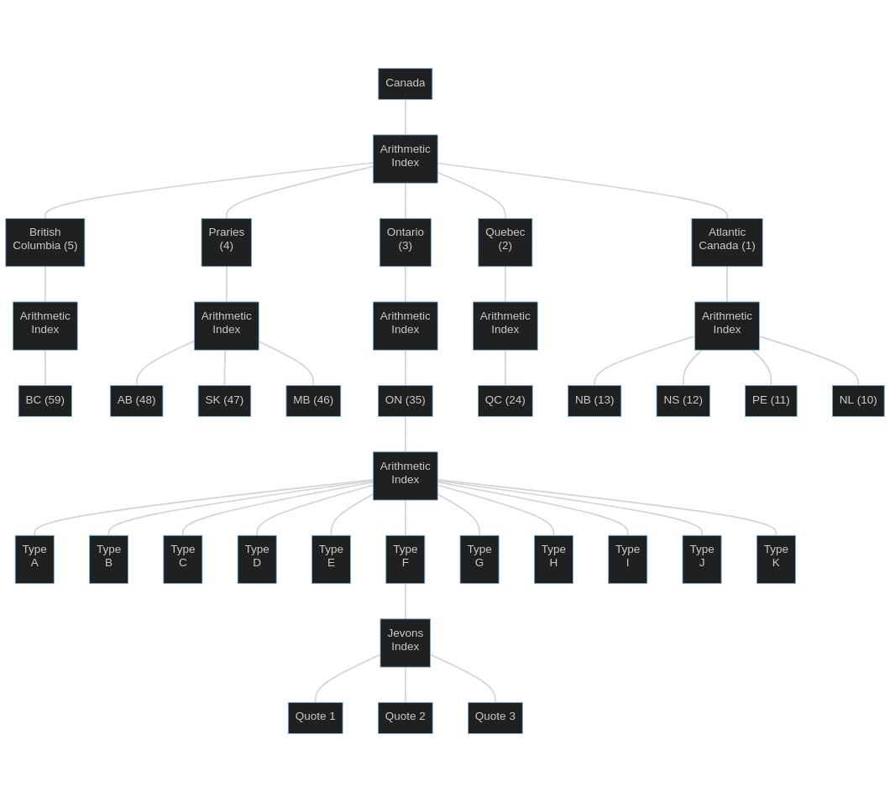

# (PART) Building a Price Index with R{-}

# Syllabus for Building a Price Index with R

Putting price-index theory into practice requires computational tools. An especially useful tool for building and analyzing price indices is the R programming language.

The goal of this module is to provide hands-on experience building and analyzing a price index with R. By the end of this module, an individual should:

1. Understand how to apply price-index theory to construct a price index.
2. Know how to compare price indices from different sources.
3. Be familiar with how to construct and analyze a price index with R. 

This module is useful for compilers of price indices with a basic understanding of the theory and construction of a price index, and who would like to put the theory into practice and gain a deeper understanding of R.

This module consists of a large assignment that has learners build and analyze a price index in R over a week. The pace of the module is self-directed, but an entire week should be devoted for this work. All data for this assignment were randomly generated.

Prerequisites: Introduction to Price Indices, and a basic understanding of R. Price Index Theory and Constant-Quality Price Indices, along with an intermediate understanding of R, are helpful.

Evaluation for this module is based on a single assignment that draws on learners' prior knowledge of price-index theory. The assignment consists of 4 questions (plus a bonus question). Collaboration on the assignment is encouraged, but each person must submit their own unique work. Answers to the assignment, along with working code for each question (excluding the bonus question) is worth 15%. The instructor must be able to understand and run your code; see [example.R](scripts/example.R) for an example. Each correctly answered question is worth an additional 10%. Correctly answering the bonus question is worth 20%. Passing this module requires a grade of 60% or more. 

Please email one of the course instructors (either [Steve Martin](mailto:steve.martin5@canada.ca) or [Rebecca Meier](mailto:rebecca.meier@canada.ca)) if you have any questions, or need help with any of the course material or assignment.

# Assignment 4

Widgets are a heavily regulated product in each of the 10 provinces, and the federal government restricts the movements of widgets between provinces. Recently, in response to public outcry about the unaffordability of widgets, the Canadian Regulatory Economic Analysis group proposed that the federal government allow inter-provincial trade of widgets to improve market access and reduce prices. Before considering designing a new policy, however, the federal government would like to evaluate how prices for widgets have increased in recent years. A price index is needed for the provincial widget markets, and the country as a whole.

The Canadian Regulatory Economic Analysis group produces a monthly Canada-wide price index for widgets (i.e., no provincial breakdown), although there is little information about their data sources or methodology. The private firm Monsterweb, a widget broker, also makes a Canada-wide price index for widgets. Given that the provincial widget markets are isolated from each other, a provincial price index is needed to evaluate how widget prices have changed over time, and whether there is a need for policy action from the government.

Widgets come in a variety of types, and a survey was used to collect monthly price quotes for a selection of representative widgets of types "A" to "J" from January 2018 to December 2019. These data are stored in the Globular Prices System. These survey data are supplemented with publicly available data for type "K" widget transactions which could not be sampled over this period, as well as the value of widgets transacted in each province in 2018 and 2019. Note that type "I" widgets were a new product in 2019, and these type of widgets replaced type "J" widgets in the sample in 2019. Due to regional variation in widget sales, the same number of price quotes could not be collected for all types of widgets in all provinces.

All of these data are summarized as follows.

|File name  |Data                                                                                                                |
|---	    |---                                                                                                                 |
|dat_gps    |Monthly price quotes for widget types "A" to "J" from January 2018 to December 2019 from the Globular Prices System.|
|dat_micro  |Publicly available microdata for daily transactions of type "K" widgets from January 2018 to December 2019.         |
|weights    |Value of widget transaction (in thousands of dollars) in each province for 2018 and 2019.                           |
|index_crea |The Canadian Regulatory Economic Analysis group's price index.                                                      |
|index_mw   |Monsterweb's price index.                                                                                           |

Your goal is to build a monthly price index for widgets, from January 2018 to December 2019, for each of the 10 provinces and the country as a whole, and to validate this index with those produced by the Canadian Regulatory Economic Analysis group and Monsterweb. You'll need to use this index to answer the following questions.

1. Which province saw the largest increase in prices since the beginning of 2018? By how much did prices change?

2. Which province saw the smallest increase in prices since the beginning of 2018? By how much did prices change?

3. What was the largest month-over-month movement in prices? In which province and month did this occur?

4. Plot all three Canada-level indices on a graph. Which index shows the largest percent increase in national widget prices since quarter 1 2019?

5. (Bonus) Calculate coefficients of variation (CVs) for the provincial indices. Using the usual quality rules for disseminating data at Statistics Canada, which provincial indices would need to be disseminated with a warning (i.e., a CV greater than 33.3)?

## Methodology

Widgets are going to be stratified by province and widget type to produce elemental indices at the province-by-widget-type level. These elemental indices should be calculated with a Jevons index. The provincial and Canada-level indices are going to be arithmetic indices that aggregate the elemental indices using value-share weights. Weights for the arithmetic indices are going to be updated in 2019, with January 2019 as the link month. The aggregation structure is summarized in the graph below.

```{r, eval=FALSE, echo=FALSE}
library(DiagrammeR)
mermaid('
    graph TD
        C[Canada] --- AA[Arithmetic <br> Index]
        AA --- BC["BC (59)"]
        AA --- AB["AB (48)"]
        AA --- SK["SK (47)"]
        AA --- MB["MB (46)"]
        AA --- ON["ON (35)"]
        AA --- QC["QC (24)"]
        AA --- NB["NB (13)"]
        AA --- NS["NS (12)"]
        AA --- PE["PE (11)"]
        AA --- NL["NL (10)"]
        ON --- A[Arithmetic <br> Index]
        A --- a[Type </br> A]
        A --- b[Type </br> B]
        A --- c[Type </br> C]
        A --- d[Type </br> D]
        A --- e[Type </br> E]
        A --- f[Type </br> F]
        A --- g[Type </br> G]
        A --- h[Type </br> H]
        A --- i[Type </br> I]
        A --- j[Type </br> J]
        A --- k[Type </br> K]
        f --- J[Jevons </br> Index]
        J --- q1[Quote 1]
        J --- q2[Quote 2]
        J --- q3[Quote 3]
')

```



## Instructions

These instructions outline a simple way to build the price index for widgets, although feel free to use a different approach if it's easier. The goal is to understand the process, rather than design the most computationally efficient system.

Run the following code to grab all the data files and put them in your working environment. Note that these data aren't perfect. It is worth remembering to check your intermediate calculations to make sure everything is as expected (e.g., with the `summary` function).

```{r, eval=FALSE}
source('https://raw.githubusercontent.com/ppd-dpp/price-index-course/master/scripts/get_data.R')
```

The [dplyr](https://cran.r-project.org/package=dplyr), [tidyr](https://cran.r-project.org/package=tidyr), [gpindex](https://cran.r-project.org/package=gpindex), and [calpr](https://github.com/ppd-dpp/calpr) packages will be used in this module. Install them as follows if they aren't already installed. (Hint: it is worth going through the documentation in the `gpindex` and `calpr` packages.)

```{r, eval=FALSE}
install.packages(c("dplyr", "tidyr", "gpindex", "devtools"))
devtools::install_github("ppd-dpp/calpr")
```

1. **Make the weights**

    Using the `weights` file, make one set of weights that give the value share of all products sold in each province in each year, and another that give the value share of each product sold within each province in each year. This first set of weights will be used to aggregate the province-level indices to a national index, and the second set of weights will be used to aggregate elemental indices to get 10 province-level indices. There should be 20 weights in the first file and 200 weights in the second file.
    
    ```{r, eval=FALSE}
library(dplyr)
library(tidyr)
library(gpindex)
library(calpr)

# Make provincial weights
weights_prov <- weights %>%
  group_by(year, province) %>% # group all sales values by reference year and province
  summarize(weight = sum(weight)) %>% # value of all sales in each province in each year
  mutate(share_prov = weights_scale(weight)) %>% # scale to sum to 1
  select(-weight) # drop the weight column as it won't be needed again

# Make product weights
weights_prod <- weights %>%
  # your code here %>%
  mutate(share_prod = weights_scale(weight)) %>%
  select(-weight)
    ```

2. **Calculate the geomean for product K**

    Using the microdata for product K in the `dat_micro` file, calculate the geometric average of the prices in each province in each month in each reference year. This file should have 250 geomeans.
    
    ```{r, eval = FALSE}
dat_micro <- dat_micro %>%
  mutate(period = year_month(period)) %>% # turn transaction dates into month-by-year dates
  # your code here %>%
  summarize(geomean = mean_geometric(price)) # calculate the geometric avergage
    ```

3. **Calculate the geomean for products A to J**

    Using the data from the Globular Prices System in `dat_gps`, calculate the geometric average of the price quotes for each product in each province in each month in each reference year, for products A to J. Combine these data with the data prepared in step 2. The resulting file should have 2,500 geomeans.
    
    ```{r, eval = FALSE}
dat_index <- dat_gps %>%
  # your code here %>%
  gather(key = "quote", value = "price", price1:price3) %>% # melt into a long dataset
  group_by(province, product, year, period) %>%
  # your code here %>%
  bind_rows(dat_micro) # append to dat_micro
    ```

4. **Calculate the period-over-period elemental indices** 

    For each product in each province in each reference year, calculate the ratio of the geometric averages computed in step 3, making sure to have a price relative of 1 in January 2018 and January 2019. (January 2019 will be the link month when it is time to chain the index.)
    
    ```{r, eval = FALSE}
dat_index <- dat_index %>%  
  # your code here
    ```

5. **Price update the product weights**

    Merge the product-by-province level weights from step 1 into the dataset created in step 4, and use the period-over-period elemental indices to price update the weights.
    
    ```{r, eval = FALSE}
dat_index <- dat_index %>%  
  # your code here %>%
  mutate(share_prod_u = weights_update(cumprod(lag(rel, default = 1)), share_prod, scale = FALSE)) # price update the weights
    ```

6. **Calculate the province-level index**

    Calculate an arithmetic index for each province in each reference year, using the period-over-period elemental indices and the price updated weights from steps 4 and 5.
    
    ```{r, eval = FALSE}
index_prov <- dat_index %>%
  group_by(period, year, province) %>%
  # your code here
    ```

7. **Calculate the Canada-level index**

    Merge the province-level weights in step 1 with the provincial indices from step 6 to calculate a Canada-level index for each reference year.
    
    ```{r, eval = FALSE}
index <- index_prov %>%
  # your code here
  group_by(period, year) %>%
  # your code here
  mutate(province = 0) %>% # province 0 is the Canada-level
  bind_rows(index_prov)
    ```

8. **Chain the 2018 and 2019 indices**

    Chain the 2018 and 2019 province-level and Canada-level indices together, using January 2019 as the link month, to get an index from January 2018 to December 2019 with January 2018 as the base period (usually the base period would be a calendar year, but there are only 24 months of data).
    
    ```{r, eval = FALSE}
index_chain <- index %>%
  group_by(province) %>%
  # your code here
  group_by(period, province) %>%
  summarize(index = unique(index)) %>% # remove the duplicate rows for the link month
  ungroup()
    ```

The end result should be a file with 11 price indices, one for each province and a national index, from January 2018 to December 2019, with January 2018 as the base period (= 100).

Validating the Canada-level index requires putting the Canadian Regulatory Economic Analysis group's index and Monsterweb's index into a common form.

9. **Quarter the monthly indices**

    Turn the index you just made and the Canadian Regulatory Economic Analysis group's index in `index_crea` into a quarterly index, with quarter 1 2019 as the base period, by taking the average of the three index values in each quarter.
    
    ```{r, eval = FALSE}
my_index <- index_chain %>%
  filter(province == '0') %>% # keep only the Canada-level index
  mutate(period = year_quarter(period)) %>%
  group_by(period) %>%
  summarize(index = mean(index)) %>%
  mutate(index = index/index[period == '2019-01-01'] * 100) # rebase to Jan 2019
    
index_crea <- index_crea %>%
  # your code here %>%
  # your code here %>%
  # your code here %>%
  # your code here %>%
  # your code here %>%
    
index_mw <- index_mw %>%
  # your code here
    ```

10. **Append all three indices together**

     Put the indices in step 9 together in one dataset with Monsterweb's index in `index_mw`. They should all be quarterly with quarter 1 2019 as the base period (= 100).
